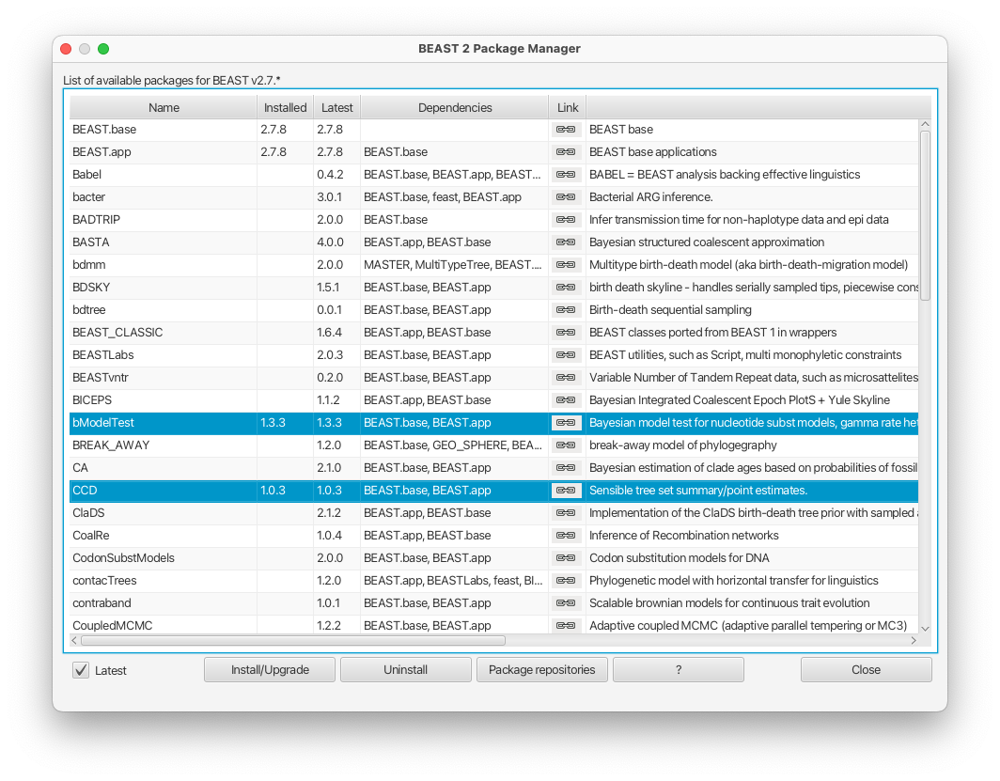
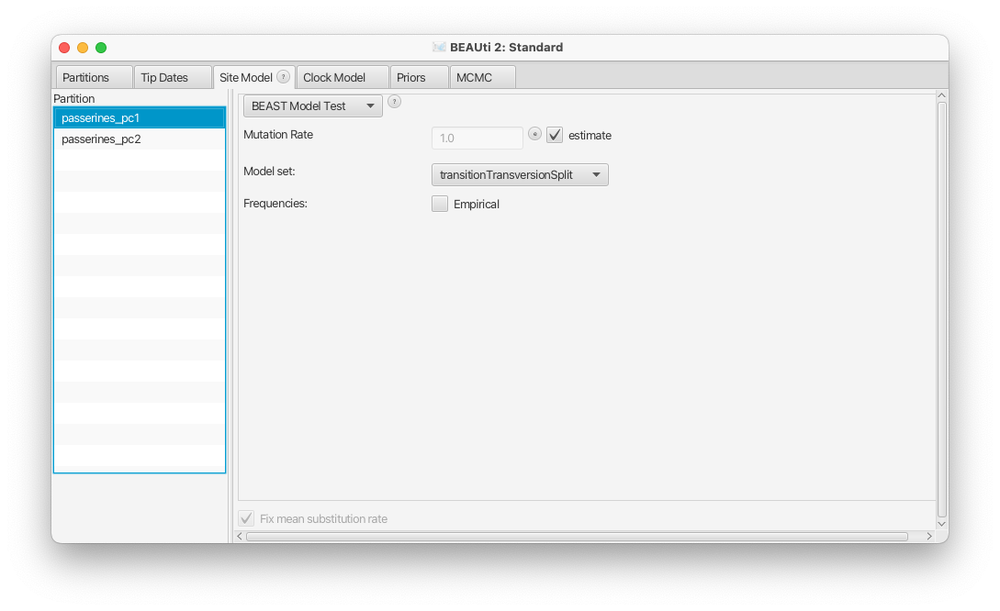
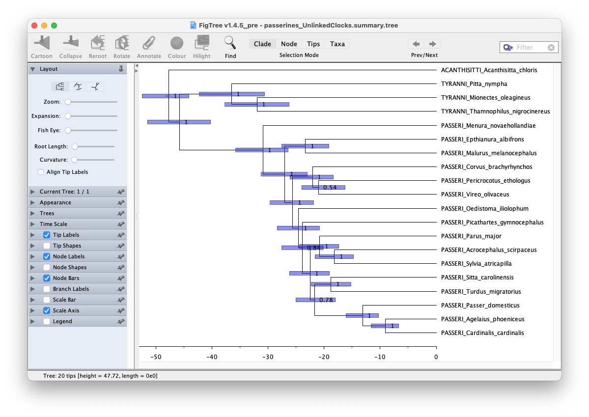

# Background

Evolutionary rate variation is an intrinsic feature of biological data, being driven by a range of life-history, environmental, and biochemical factors. Rates of molecular evolution can vary across lineages, across nucleotide sites, and across regions of the genome. These forms of variation can interact to produce complex patterns of heterogeneity in the data, particularly at the genomic scale . Thus, accounting for evolutionary rate variation represents an important aspect of phylogenetic analysis and molecular dating . A range of models are available for this purpose. 

This tutorial will provide an introduction to using multiple relaxed clock models to account for rate variation across lineages and across subsets of the data set. The tutorial will use mitochondrial genome data from passerine birds. The exercise will guide you through setting up two contrasting models of among-lineage rate variation to estimate phylogenetic relationships, evolutionary rates, and node times using the program BEAST v{{ page.beastversion }}.

----

# Programs used in this Exercise 

### BEAST2 - Bayesian Evolutionary Analysis Sampling Trees

BEAST2 ([http://beast2.org](http://beast2.org)) is a free software package for Bayesian evolutionary analysis of molecular sequences using MCMC and strictly oriented toward inference using rooted, time-measured phylogenetic trees. This tutorial is written for BEAST v{{ page.beastversion }} .

### BEAUti2 - Bayesian Evolutionary Analysis Utility

BEAUti2 is a graphical user interface tool for generating BEAST2 XML configuration files.

Both BEAST2 and BEAUti2 are Java programs, which means that the exact same code runs on all platforms. For us it simply means that the interface will be the same on all platforms. The screenshots used in this tutorial are taken on a Mac OS X computer; however, both programs will have the same layout and functionality on both Windows and Linux. BEAUti2 is provided as a part of the BEAST2 package so you do not need to install it separately.

### TreeAnnotator

TreeAnnotator is used to produce a summary tree from the posterior sample of trees using one of the available algorithms. It can also be used to summarise and visualise the posterior estimates of other tree parameters (e.g. node height).

TreeAnnotator is provided as a part of the BEAST2 package so you do not need to install it separately.

### LogCombineer

LogCombiner is used to combine log and tree files from multiple runs of BEAST2. LogCombiner can also be used to subsample chains or discard the burn-in. 

LogCombiner is provided as a part of the BEAST2 package so you do not need to install it separately.

### Tracer 

Tracer ([http://beast.community/tracer](http://beast.community/tracer)) is used to summarize the posterior estimates of the various parameters sampled by the Markov Chain. This program can be used for visual inspection and to assess convergence. It helps to quickly view median estimates and 95% highest posterior density intervals of the parameters, and calculates the effective sample sizes (ESS) of parameters. It can also be used to investigate potential parameter correlations. We will be using Tracer v{{ page.tracerversion }}.

### FigTree

FigTree ([http://beast.community/figtree](http://beast.community/figtree)) is a program for viewing trees and producing publication-quality figures. It can interpret the node-annotations created on the summary trees by TreeAnnotator, allowing the user to display node-based statistics (e.g. posterior probabilities). We will be using FigTree v{{ page.figtreeversion }}.

----

# Practical: Using multiple clock models

This tutorial will walk you through an analysis of mitochondrial genome data from 20 passerine birds, representing the three suborders of this highly diverse order of vertebrates. Specifically, the data set comprises the first and second codon sites of the 13 protein-coding genes that are found in the mitochondrial genome. The analyses will include two different configurations of clock models to account for evolutionary rate variation in the data. 

## The data 

Passerines (Order Passeriformes), also known as perching birds, comprise nearly 60% of all living bird species. They have diversified into a broad range of ecological roles and can be found in almost all habitats across the world ([Figure 1](#passerines1)). Mitochondrial genomes have been sequenced for hundreds of passerine species. 

<figure>
	
	
	<figcaption>Figure 1: Rifleman (<i>Acanthisitta chloris</i>; <i>Acanthisitti</i>), Fairy Pitta (<i>Pitta nympha</i>, <i>Tyranni</i>), and American Robin (<i>Turdus migratorius</i>; <i>Passeri</i>), representing the three major lineages of passerine birds. Creative Commons photographs by Brian Ralphs, Jason Thompson, Rhododendrites.</figcaption>
</figure>
 

**The data files for this tutorial can be downloaded from the left-hand panel.** The data set in this tutorial includes publicly available nucleotide sequences that were assembled for a study of evolutionary rate variation in mitochondrial genomes from passerine birds .

The data set comprises two separate mitochondrial sequence alignments from the 20 passerine taxa. The files contain the first codon sites (`passerines_pc1.nex`) and second codon sites (`passerines_pc2.nex`) of the 13 protein-coding genes in the mitochondrial genome. Together, these data sets comprise 7232 aligned nucleotide sites. The third codon sites have been excluded because they show signs of substitution saturation – they evolve rapidly and have undergone such a large amount of change that the evolutionary signal has been eroded. 

## Creating the analysis file with BEAUti

We will use BEAUti2 to select the priors and starting values for our analysis and save these settings into a BEAST2 XML file.

> Begin by starting **BEAUti2**.

### Installing BEAST2 packages

Next, we need to install two BEAST2 packages that will be used in this analysis. The packages are called **bModelTest** and **CCD**.

> Open the **BEAST 2 Package Manager** by navigating to **File > Manage Packages**. Install the **bModelTest** and **CCD** packages by selecting it and clicking the **Install/Upgrade** button ([Figure 2](#packagemanager)). 
>
>

<figure>
	
	
	<figcaption>Figure 2: Installing bModelTest and CCD in the BEAST 2 Package Manager. </figcaption>
</figure>
 

After the installation of a package, the program is on your computer, but BEAUti2 is unable to load the template files for the newly installed model unless it is restarted. So, you will now need to restart BEAUti2 so that bModelTest and CCD are available. 

> Close the **BEAST 2 Package Manager** and restart **BEAUti2** to load the **bModelTest** and **CCD** packages.

### Importing the sequence alignments

Next we will load the sequence alignments from our two NEXUS files.

> In the **Partitions tab**, import the data files by navigating to **File > Import Alignment** in the menu and then finding the data files `passerines_pc1.nex` and `passerines_pc2.nex` on your computer. Alternatively, you can simply drag and drop the files into the **BEAUti2** window.

Now that the data are loaded into BEAUti2, we can unlink the site models, link the clock models, link the trees, and rename these variables so that they are easier to understand in the output files. 

> Highlight the two data subsets (using **shift and click**) and click on **Unlink Site Models** to assume different models of sequence evolution for each of the two data subsets (the site models are typically already unlinked by default). Click the **Link Clock Models** button so that the two data subsets share the same model of branch rates. Click the **Link Trees** button to ensure that both data subsets share the same tree topology and branching times ([Figure 3](#partitions_linked)). 
>
> Double click on the clock model for the first codon sites (**passerines_pc1**) and rename it to **passerinesClock**. Then click on the tree for the first codon sites (**passerines_pc1**) and rename it to **passerinesTree**. 

<figure>
	
	
	<figcaption>Figure 3: Unlinking site models and linking clock models and trees in the Partitions tab of BEAUti2. </figcaption>
</figure>
 

### Specifying the Site Model

The data set has been separated into the first and second codon sites of the mitochondrial protein-coding genes. The first and second codon sites are under differing degrees of selective constraint, so they typically show quite different patterns of evolution. Nucleotide changes at second codon sites often change the encoded amino acid (these are known as “nonsynonymous changes”), so they are under the greatest selective constraint and evolve the most slowly. In contrast, many of the changes at first codon sites do not result in a change to the encoded amino acid (these are known as “synonymous changes”), so they are under a lesser degree of selective constraint. We have excluded the third codon sites, where most nucleotide replacements are synonymous and thus do not change the encoded amino acid. Because most changes at third codon sites are synonymous, these changes occur at a high rate and third codon sites tend to become saturated with substitutions over time.  

Given the contrasting evolutionary dynamics at first and second codon sites, we will allow a distinct model of sequence evolution for each of these data subsets. Instead of choosing specific nucleotide substitution models, however, we will use Bayesian model averaging. This approach allows us to treat the site models as nuisance parameters because they are not of immediate interest. Consequently, our estimates of the phylogeny, evolutionary rates, and node times will be averaged over the site models . 

> Navigate to the **Site Model** tab. Select the first data subset (**passerines_pc1**) and select **BEAST Model Test** from the drop-down list. Check the **estimate box** for the **Mutation Rate**. Do the same for the second data subset (**passerines_pc2**). By checking the estimate boxes for the two mutation rates, we will be estimating the relative evolutionary rates for the first and second codon sites ([Figure 4](#sitemodel)). 

<figure>
	
	
	<figcaption>Figure 4: Setting up BEAST Model Test for the site models for the two data subsets in the Site Model tab of BEAUti2. </figcaption>
</figure>
 

### Specifying the Clock Model

Here, we can specify the model of rate variation across branches of the tree. For this analysis we will use an uncorrelated lognormal model of branch-rate variation. The Relaxed Clock Log Normal option assumes that the substitution rates on each branch are independently drawn from a single, discretised lognormal distribution .

> Navigate to the **Clock Model** tab. Select **Relaxed Clock Log Normal** from the drop-down list. 

The lognormal distribution has the advantage that one can estimate its variance, which reflects the extent to which the molecular clock needs to be relaxed. The uncorrelated relaxed clock models in BEAST2 are discretised for computational feasibility. This means that for any given parameters of the lognormal distribution, the probability density is discretised into some number of discrete rate bins. Each branch is then assigned to one of these bins. By default, BEAUti2 sets the **Number Of Discrete Rates** to **-1**. This means that the number of bins is equal to the number of branches in the tree. 

Note that although we have assumed that first codon sites and second codon sites all share the same pattern of rate variation across branches, we have allowed these two data subsets to have different relative rates (by checking the two **estimate** boxes in the **Site Model** tab). This approach is commonly used because it captures some of the most important forms of evolutionary rate variation, without requiring the large number of parameters that would be introduced if we were to assign a separate relaxed clock to each data subset . 

### Creating taxon sets

Studies of genomic data have supported the division of passerines into three suborders: Acanthisitti, Tyranni, and Passeri (e.g., ). Together, Tyranni and Passeri form the group Eupasseres, which contains nearly all of the living passerine species (with the exception of the New Zealand wrens, suborder Acanthisitti). We can use these previous estimates of passerine relationships to place constraints on the tree topology ([Figure 5](#passerine_evolution)). 

<figure>
	
	
	<figcaption>Figure 5: Evolutionary relationships among the three suborders of passerine birds. </figcaption>
</figure>
 

In addition, we can use a previous phylogenetic estimate of the age of the passerine crown group to inform the prior distribution for the age of the root. To incorporate these pieces of information, we need to create taxon sets in BEAUti2. 

> Navigate to the **Priors** tab and scroll to the bottom of the window. Click the **+ Add Prior** button to create a new taxon set. To do so select the MRCA prior option from the drop-down list ([Figure 6](#taxonsets)). Enter **Tyranni** for the **Taxon set label**, select the three taxa labelled with Tyranni, move these to the right-hand column, and click **OK** ([Figure 6](#taxonsets)). 

<figure>
	
	
	<figcaption>Figure 6: Defining a taxon set called “Tyranni” in the Taxon set editor in BEAUti2.</figcaption>
</figure>
 

> Create a new taxon set for Passeri by clicking the **+ Add Prior** button. Enter **Passeri** for the **Taxon set label**, select the 16 taxa labelled with Passeri, move these to the right-hand column, and click **OK**.
>
> Create a new taxon set for Eupasseres by clicking the **+ Add Prior** button. Enter **Eupasseres** for the **Taxon set label**, select all 19 of the taxa labelled with Tyranni and Passeri, move these to the right-hand column, and click **OK**.
>
> Create a new taxon set for Passeriformes by clicking the **+ Add Prior** button. Enter **Passeriformes** for the **Taxon set label**, select all 20 taxa in the data set, move these to the right-hand column, and click **OK**.
>
> Back in the **Priors** tab, check the **monophyletic** boxes next to each of these four groups that have been defined. 

By enforcing monophyly on the group Eupasseres, which includes all of the taxa except the Rifleman (_Acanthisitta chloris_), we are forcing the root of the tree to be placed between Acanthisitti and Eupasseres. 

### Specifying a calibration prior on the root

In the **Priors** tab we can add an informative prior on the age of the root, based on a previous phylogenetic estimate of the age of crown passerines. This will allow us to calibrate the clock model. A recent study estimated the age of the passerine crown node at 48 million years, with a range of 43–53 million years . We can approximate this using a lognormal distribution with an offset (minimum) of 43, mean of 5, and standard deviation of 0.5. 

> Change the prior distribution on the age of **Passeriformes** to a **Log Normal** distribution. Reveal the options for the prior on **Passeriformes.prior** by clicking on the . Change the prior distribution by selecting **Log Normal** from the drop-down list. Check the box marked **Mean In Real Space** and set the mean **M** equal to **5.0** and the standard deviation **S** to **0.5**. Set the **Offset** of the lognormal distribution to **43.0** ([Figure 7](#rootcalibration)). 

<figure>
	
	
	<figcaption>Figure 7: Specifying an offset lognormal prior distribution on the age of the root. </figcaption>
</figure>
 

### Specifying the remaining priors

In the **Priors** tab we will leave the priors for the parameters of the site models at the default settings. 

Since we are assuming that the branch rates are drawn from a lognormal distribution, this induces two hyperparameters: the mean (**ucldMean.c**) and standard deviation (**ucldStdev.c**). These are known as hyperparameters because they are parameters of the prior distribution. The hyperparameters have their own priors, known as hyperpriors. We will leave the priors for these hyperparameters at the default settings. 

Next we will specify the prior distribution on the tree topology and branching times in the Priors tab. To reflect the evolutionary history of the passerine clade, we will use a model of diversification that accounts for both speciation and extinction. 

> Change the tree model for **Tree.t:passerinesTree** to **Birth Death Model**. 

The birth death model also has two hyperparameters: the diversification or relative birth rate (**BDBirthRate.t**), equal to the difference between the speciation and extinction rates, and the turnover or relative death rate (**BDDeathRate.t**), equal to the extinction rate divided by the speciation rate. Just like the clock model these two hyperparameters also have hyperpriors and as with the clock model we will leave these priors at the default settings. 

Remember that in a real analysis we should use our prior knowledge to inform prior choices and not simply leave priors at the default settings! 

### Set MCMC options and save the XML file

Now that you have specified all of your data elements, models, priors, and operators, go to the **MCMC** tab to set the length of the Markov chain, sample frequency, and file names.

> Navigate to the **MCMC** tab. Since we have a limited amount of time for this exercise, change the **Chain Length** to **2,000,000**.
>
> Reveal the options for the **tracelog** using the  to the left. Change **Log Every** to **200**. Change the File Name to `passerines_LinkedClocks.log`.
>
> Reveal the options for the **treelog** using the  to the left. Change **Log Every** to **200**. Change the File Name to `passerines_LinkedClocks.trees`. 

Now we are ready to save the XML file!

> Go to **File > Save As** and save the XML file as `passerines_LinkedClocks.xml`. Close **BEAUti2** when you are done. 

## Using multiple relaxed clocks

Now we will set up a second analysis in which we unlink the clock models between the two data subsets, so that one relaxed clock model is applied to the first codon sites and a second, separate relaxed clock model is applied to the second codon sites. 

> Open **BEAUti2**. In the **Partitions** tab, import the data files `passerines_pc1.nex` and `passerines_pc2.nex`.
> 
> Highlight the two data subsets (using **shift and click**) and click on **Unlink Site Models**. Then, click on **Unlink Clock Models** so that separate clock models are applied to the two data subsets. Click **Link Trees** to ensure that both data subsets share the same tree topology and branching times ([Figure 8](#partitions_unlinked)).
>
> Double click on the tree for the first codon sites (**passerines_pc1**) and rename it to **passerinesTree**. 

<figure>
	
	
	<figcaption>Figure 8: Unlinking site models and clock models and linking trees in the Partitions tab of BEAUti2. </figcaption>
</figure>
 

Now set up BEAST Model Test for the site models, but this time we do not want to apply relative rate parameters to the first codon sites and second codon sites. This is because the different rates in these two data subsets will be taken into account in the clock models themselves. 

> Navigate to the **Site Model** tab. Select the first data subset (**passerines_pc1**) and select **BEAST Model Test** from the drop-down list. This time, do NOT check the **estimate box**. Repeat for the second data subset (**passerines_pc2**).

Now we will set up a separate relaxed clock model for each of the two data subsets. 

> Navigate to the **Clock Model** tab. Select the first data subset (**passerines_pc1**) and select **Relaxed Clock Log Normal** from the drop-down list. Repeat for the second data subset (**passerines_pc2**).  

As with the first part of this exercise, we will need to define taxon sets in order to implement constraints on the tree topology and to specify a calibration prior on the root. 

> Navigate to the **Priors** tab. Define the four taxon sets Tyranni, Passeri, Eupasseres, and Passeriformes, as described the first part of this exercise. Back in the **Priors** tab, check the **monophyletic** boxes next to each of these four groups that have been defined.

Set up a lognormal calibration prior on the root, as described in the first part of this exercise. 

> Change the prior distribution on the age of **Passeriformes** to a **Log Normal** distribution. Reveal the options for the prior on **Passeriformes.prior** by clicking on the . Change the prior distribution by selecting **Log Normal** from the drop-down list. Check the box marked **Mean In Real Space** and set the mean **M** equal to **5.0** and the standard deviation **S** to **0.5**. Set the **Offset** of the lognormal distribution to **43.0** ([Figure 7](#rootcalibration)). 

Next we will specify the prior distribution on the tree topology and branching times. 

> Change the tree model for **Tree.t:passerinesTree** to **Birth Death Model**. 

Now that you have specified all of your data elements, models, priors, and operators, go to the MCMC tab to set the length of the Markov chain, sample frequency, and file names.

> Navigate to the **MCMC** tab. Since we have a limited amount of time for this exercise, change the **Chain Length** to **2,000,000**.
>
> Reveal the options for the **tracelog** using the  to the left. Change **Log Every** to **200**. Change the File Name to `passerines_UnlinkedClocks.log`.
>
> Reveal the options for the **treelog** using the  to the left. Change **Log Every** to **200**. Change the File Name to `passerines_UnlinkedClocks.trees`. 

Now we are ready to save the XML file!

> Go to **File > Save As** and save the XML file as `passerines_UnlinkedClocks.xml`. Close **BEAUti2** when you are done. 

----

## Running BEAST2

Now you are ready to start your BEAST2 analyses. 

> Execute `passerines_LinkedClocks.xml` in **BEAST2**. You should see the screen output every 1000 steps, reporting the likelihood and various other statistics.

----

## Summarising the output

Once the BEAST2 analysis is complete, you will find three new files in your directory. The MCMC samples of various parameters and statistics are written to the file called `passerines_LinkedClocks.log`. The tree state at every sampled step is saved to `passerines_LinkedClocks.trees`. The file called `passerines_LinkedClocks.xml.state` summarises the performance of the proposal mechanisms (operators) used in your MCMC analysis, providing information about the acceptance rate for each move.

The main output files are the `.log` and `.trees` files. We will use **Tracer** to assess convergence and mixing. Tree topologies, branch rates, and node times are summarised using the program **TreeAnnotator** and visualised in **FigTree**.

### Tracer

For the analyses using linked and unlinked clock models, _pre-cooked_ output files from two replicate runs of BEAST2 are provided with this exercise. Each replicate analysis was run for 20,000,000 MCMC steps. **The pre-cooked files can be found in the left-hand panel**. Note that some of the files are compressed with zip and you will first need to extract them after downloading.

> Open Tracer and import `passerines_LinkedClocks.rep1.log` and `passerines_LinkedClocks.rep2.log` using **File > Import Trace File**.
>
> In the **Trace Files** panel, select the two log files using **shift and click**. Display the **Marginal Density** in the right-hand panel. 

For each parameter, the marginal posterior densities from the two runs are shown in different colours. If you look through the various parameters, you will see that the marginal densities are nearly identical between the two runs ([Figure 9](#tracer_marginals)). This suggests that the two runs have converged on the stationary distribution. By default, 10% of the samples are treated as ‘burn-in’ and are excluded from the summary. 

<figure>
	
	
	<figcaption>Figure 9: Checking that both chains converged to the same posterior.</figcaption>
</figure>
 

> In the **Trace Files** panel, select **Combined** to display the results from the combined samples from the two runs.

Now have a look at the posterior density of the age of the root (crown Passeriformes). 

> In the **Traces** panel, select **mrca.age(Passeriformes)** and view **Estimates** in the right-hand panel ([Figure 10](#tracer_passerineroot)). 

<figure>
	
	
	<figcaption>Figure 10: Viewing the posterior probability density of the age of Passeriformes in Tracer.</figcaption>
</figure>
 

Consider whether this posterior density matches the calibration prior that we specified for the age of the root. There are some other parameters that are of particular interest in this analysis. 

The **BMT.gammaShape.1** and **BMT.gammaShape.2** parameters show the posterior densities of the shape parameter for gamma-distributed rates across sites. Values below 1 indicate that there is substantial rate variation across the nucleotide sites in the alignment, with most sites evolving slowly but with some sites evolving rapidly. 

The **rate.mean** parameter shows the posterior density of the mean substitution rate throughout the phylogeny (weighted by branch lengths). Because the analysis was calibrated to a timescale of millions of years, based on the calibration prior on the root of the tree, the substitution rate is given in substitutions per site per _million_ years. 

The **rate.coefficientOfVariation** parameter indicates the amount of variation in the substitution rates across branches. The coefficient of variation is computed as the standard deviation divided by the mean. A value of 0 indicates that substitution rates do not vary across the tree, which would be consistent with a strict molecular clock. Values above 1 indicate extreme rate variation across branches. 

The **BMT_mutationRate.1** parameter is the relative evolutionary rate of the first codon sites, while the **BMT_mutationRate.2** parameter is the relative evolutionary rate of the second codon sites. First codon sites are under less selective constraint and so we expect them to evolve more quickly than second codon sites ([Figure 11](#tracer_mutationrates)). 

<figure>
	
	
	<figcaption>Figure 11: The relative evolutionary rates of first and second codon sites.</figcaption>
</figure>
 

Now we can compare the results from the analysis using unlinked clock models. 

> In **Tracer**, remove the files from the linked clock analysis by clicking on the **–** button below the **Trace Files** panel. 
>
> Import `passerines_UnlinkedClocks.rep1.log` and `passerines_UnlinkedClocks.rep2.log` using **File > Import Trace File**.
>
> In the **Trace Files** panel, select **Combined** to display the results from the combined samples from the two runs.

There are several parameters of particular interest in this analysis. 

The **rate.1.mean** and **rate.2.mean** parameters give the posterior densities of the mean substitution rates of the first and second codon sites, respectively. These are absolute (rather than relative) rates, given in substitutions per site per million years. They should be in approximately the same ratio as seen in the analysis using linked clock models. To look at both rates together in Tracer we have to display the rates on a logarithmic scale ([Figure 12](#tracer_logclockrates)).

> In **Tracer**, select the two mean substitution rates using **shift and click**. Next, click on **Setup** below the plot and check the **Log axis** box under **Y Axis**.

<figure>
	
	
	<figcaption>Figure 12: Viewing the posterior probability densities of the coefficients of rate variation in Tracer.</figcaption>
</figure>
 

The **rate.1.coefficientOfVariation** and **rate.2.coefficientOfVariation** parameters indicate the amount of variation in the substitution rates across branches, for first codon sites and second codon sites, respectively ([Figure 13](#tracer_cov)). In this case they are fairly similar, but perhaps different enough to justify the use of unlinked clock models for these two subsets of the data. 

<figure>
	
	
	<figcaption>Figure 13: Viewing the posterior probability densities of the coefficients of rate variation in Tracer.</figcaption>
</figure>
 

### Summarising the trees in TreeAnnotator

For each of our two analyses, we have reviewed the trace files from the two independent runs in Tracer and verified that both runs converged on the posterior distributions and reached stationarity. We can now combine the sampled trees into a single tree file and summarise the results. For simplicity, we will only do this for the analysis that used unlinked clock models. 

> Open the program **LogCombiner** and set the **File type** to **Tree Files**. Next, import `passerines_UnlinkedClocks.rep1.trees` and `passerines_UnlinkedClocks.rep2.trees` using the **+** button. Set a burn-in percentage of **10** for each file, thus discarding the first 10% of the samples in each tree file.
>
> Click on the **Choose file ...** button to create an output file and run the program. Name the file `passerines_UnlinkedClocks.combined.trees` ([Figure 14](#logcombiner)).

<figure>
	
	
	<figcaption>Figure 14: Combining tree samples from the two replicate runs in TreeAnnotator.</figcaption>
</figure>
 

Once LogCombiner has terminated, you will have a file containing 18,000 trees that can be summarised using TreeAnnotator. TreeAnnotator takes a collection of trees and produces a summary so that we can interpret the results more easily. There are various ways to summarise the collection of sampled trees, but here we will use an estimate based on conditional clade distributions (using the clade frequencies in the sampled trees). A description of how this “CCD0” tree is computed can be found on the [BEAST2 website](http://www.beast2.org/2025/03/01/CCD0-revisited.html). 

> Open the program **TreeAnnotator**. Since we already discarded a set of burn-in trees when combining the tree files, we can leave **Burn in percentage** set to **0**. For the **Target tree type**, choose **MAP (CCD0)**. For **Node heights**, choose **Common Ancestor heights**. For **Input Tree File**, choose your combined file `passerines_UnlinkedClocks.combined.trees`. Then name the **Output File** `passerines_UnlinkedClocks.summary.tree` and click **Run**.

### Visualising the dated tree

The tree file produced by TreeAnnotator contains the CCD0 tree and is annotated with summaries of the various parameters. The summary tree and its annotations can be visualised in the program FigTree.

> Execute **FigTree** and open the file `passerines_UnlinkedClocks.summary.tree`.

We will adjust some of the settings to improve the visualisation of the tree and to aid your interpretation of the phylogenetic relationships and evolutionary timescale. For example, we can label the nodes with their posterior probabilities and add coloured bars to the nodes to display the 95% credible intervals for the node times. 

> 1. Rearrange the tree using **Tree > Decreasing Node Order**. 
> 2. Uncheck the box next to **Scale Bar** to remove the scale bar. 
> 3. To display a timescale, check the **Scale Axis** box. Reveal the options for the scale axis by clicking on the , then check the **Reverse axis** box. 
> 4. To display the node posterior probabilities, check the **Node Labels** box. Reveal the options for the node labels by clicking on the , then select **posterior** from the drop-down list next to **Display**. 
> 5. To display the 95% credible intervals for the node times, check the **Node Bars** box. Reveal the options for the node bars by clicking on the , then select **height_95%_HPD** from the drop-down list next to **Display** ([Figure 15](#figtree)). 

<figure>
	
	
	<figcaption>Figure 15: Visualising the CCD0 tree in FigTree.</figcaption>
</figure>
 

Examine the structure of the tree and the timing of the major divergences among orders. You will notice that the suborders Tyranni and Passeri split from each other soon after their divergence from Acanthisitti. The crown nodes of Tyranni and Passeri have similar ages of around 30 to 35 million years. The suborder Passeri, also known as songbirds, contains about 50% of all living bird species ([Figure 16](#passerines2)). 

<figure>
	
	
	<figcaption>Figure 16: Representatives of the highly diverse passerine suborder Passeri: Superb Lyrebird (<i>Menura novaehollandiae</i>), Red-backed Fairywren (<i>Malurus melanocephalus</i>), and House Sparrow (<i>Passer domesticus</i>). Creative Commons photographs by David Cook, Summerdrought, and Mathias Appel.</figcaption>
</figure>
 

----

# Summary of outcomes

In this exercise, you analysed a mitochondrial data set from 20 passerine birds and used several approaches to account of variation in evolutionary rates:

- Rate variation across nucleotide sites modelled using a gamma distribution.
- Rate variation across codon sites modelled using parameters for relative rates (linked clocks) or absolute rates (unlinked clocks). 
- Rate variation across branches modelled using uncorrelated lognormal relaxed clocks. 

These are among the dominant forms of rate variation in molecular data and need to be taken into account in studies of evolutionary timescales. In addition, using a secondary calibration at the root of the tree, you were able to infer the evolutionary timescale of passerines, including the divergence times of the major lineages of this diverse and ecologically important group of birds. 

----

# Useful Links

- [Bayesian Evolutionary Analysis with BEAST 2](http://www.beast2.org/book.html) 
- BEAST 2 website and documentation: [http://www.beast2.org/](http://www.beast2.org/)
- Join the BEAST user discussion: [http://groups.google.com/group/beast-users](http://groups.google.com/group/beast-users) 

----

# Relevant References


